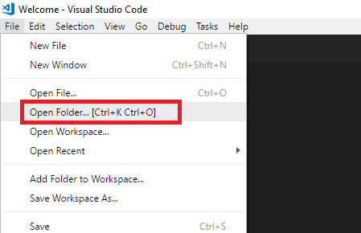
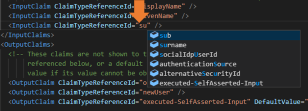
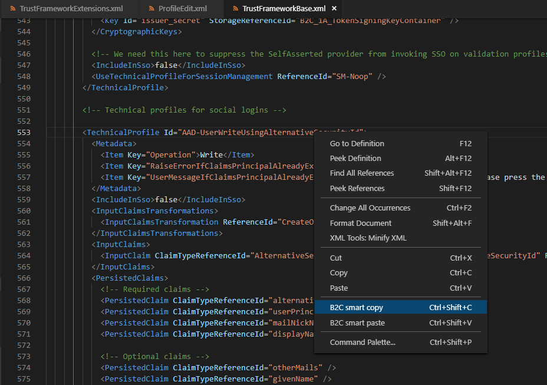
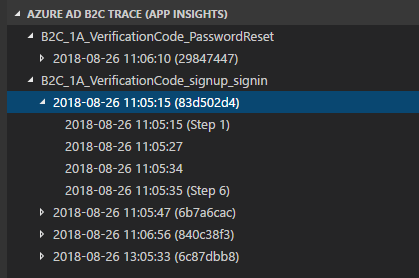
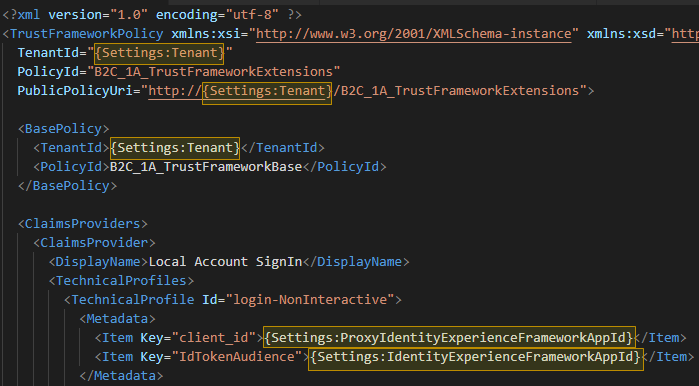
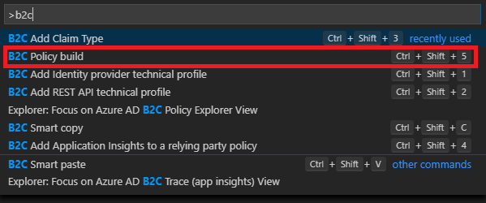

# Azure AD B2C extension

The Azure AD B2C extension for VS Code lets you quickly navigate through Azure AD B2C [custom policy](https://docs.microsoft.com/en-us/azure/active-directory-b2c/active-directory-b2c-overview-custom). Create elements, such as: technical profiles and claim definition. For more information, see [Get started with custom policies](https://docs.microsoft.com/en-us/azure/active-directory-b2c/active-directory-b2c-get-started-custom).

## Get started
To start working with your custom policy. Open you Visual Studio Code, and open your folder that containing the custom policy XML files. Or open the policy XML files directly from any folder.



# Azure AD B2C Custom policy Features

## Policy uplaod
You can now upload your policy directly from VS Code. Read more [here](https://github.com/yoelhor/aad-b2c-vs-code-extension/blob/master/src/help/policy-upload.md) 

## Autocomplete 
With autocomplete feature, you can save your time customizing a B2C policy. B2C extension provides you the list of policy settings, claims, technical profiles, and claims transformation aggregated from your policy files. Select one of the following attributes and click **ctrl+space** (cmd+space), or start:


 

## Custom policy explorer
From **Custom policy explorer** click the XML element type and select the element you want to open. Note: custom policy explorer shows elements from  selected file only.


## Go to definition and find all references
To go any XML element definition. Clt-Click, click F12 or right-click and select **Go to definition** or **Peak definition**. Note: Go to definition navigates you to the source element in the selected file only.

To search for references in your **Open folder** XML files or any XML file you open with VS code, select **Find all references** or click Shift+F12.


## Adding XML elements
You can add following elements to your policy. Note: make sure your cursor is located in the right place.
* B2C Add Identity provider technical profile (shift+ctrl+1)
* B2C Add REST API technical profile (shift+ctrl+2)
* B2C Add Claim Type (shift+ctrl+3)
* B2C Add Application Insights (debug mode) (shift+ctrl+4)


## Smart Copy & Paste
When you customize an XML element in the extension policy, **Smart Copy** allows you copy the entire element with its parents elements from the base policy. For example, when you copy the AAD-UserWriteUsingAlternativeSecurityId technical profile, smart copy generates an XML containing the following elements, so you don't need to look for the parents element, such as the claim provider. 

```XML
<ClaimsProviders>
  <ClaimsProvider>
    <DisplayName>Azure Active Directory</DisplayName>
    <TechnicalProfiles>
      <TechnicalProfile Id="AAD-UserWriteUsingAlternativeSecurityId">
        ...
      </TechnicalProfile>
    </TechnicalProfiles>
  </ClaimsProvider>
<ClaimsProviders>
```

On contrariety, the **Smart Paste**, pastes from the clipboard only the necessary elements. Given the above XML, and your extension policy already has a claims provider named `Azure Active Directory`, the smart paste will paste only the technical profile without the claims provider. But if there is no such claims provider, the smart paste will paste the entire XML (including the claims provider and the technical profile).



>Note: In this version the samrt copy and paste is limited to a single XML node. 


## Help and more information
After you run the commends, B2C extension shows you information message with a link to relevant article.


## XML Schema quick help

Move your mouse over any XML tag name, to see the description


## Application Insights
Collect logs from Azure AD B2C and diagnose problems with your Azure AD B2C vocode extension. Read more [here](https://github.com/yoelhor/aad-b2c-vs-code-extension/blob/master/src/help/app-insights.md). The logs are organized by the **policy name**, **correlation Id** (the application insights presents the first digit of the correlation Id), and the **log timestamp**. This allows you to find the relevant log based on the local timestamp and see the user journey as executed by Azure AD B2C.



## Policy Settings
Allows you to manage the values of your Azure AD B2C environments. When you execute the **B2C Policy build** command, the VS code extension finds and replaces the values of your settings with the ones configure in the policy file, and creates a directory that contains all of your policy files (after the replacement). In the following example, the extension replaces the keys with the value configure in the `appsettings.json` file: 
- {Settings:Tenant}
- {Settings:ProxyIdentityExperienceFrameworkAppId}
- {Settings:FacebookAppId}



The configuration `appsettings.json` file contains the keys with their values for each environment. 
- **Name** contains the environment name which VS code extension uses to create the environment folder (under the environments parent folder). Use your operation system legal characters only. 
- **Tenant** specifies the tenant name, such as contoso.onmicrosoft.com. In the policy file, use the format of **Settings:Tenant**, for example `{Settings:Tenant}`.
-  **Production**  (boolean) is preserved for future use, indicating whether the environment is a production one. 
- **PolicySettings** contains a collection of key-value pair with your settings. In the policy file, use the format of **Settings:** and the key name, for example `{Settings:FacebookAppId}`.


To build your policy, type `Ctrl+Shift+P`, which brings up the Command Palette. From here, type `B2C` and select **B2C Policy Build**. You have access to all of the B2C functionality of VS Code, including keyboard shortcuts `Ctrl+Shift+5`.



On the first time, you run the **B2C Policy build** command, the VS code extension lets you create the  `appsettings.json` file, with default set of environments, keys, and values:

```JSON
{
  "Environments": [
  {
    "Name": "Development",
    "Production": false,
    "Tenant": "your-tenant.onmicrosoft.com",
    "PolicySettings" : {
      "IdentityExperienceFrameworkAppId": "Your dev environment AD app Id",
      "ProxyIdentityExperienceFrameworkAppId": "Your AD dev environment Proxy app Id",
      "FacebookAppId": "0"
    }
  },
  {
    "Name": "Test",
    "Production": false,
    "Tenant": "your-tenant.onmicrosoft.com",
    "PolicySettings" : {
      "IdentityExperienceFrameworkAppId": "Your test environment AD app Id",
      "ProxyIdentityExperienceFrameworkAppId": "Your test environment AD Proxy app Id",
      "FacebookAppId": "0"
    }
  },
  {
    "Name": "Production",
    "Production": true,
    "Tenant": "your-tenant.onmicrosoft.com",
    "PolicySettings" : {
      "IdentityExperienceFrameworkAppId": "Your production environment AD app Id",
      "ProxyIdentityExperienceFrameworkAppId": "Your production environment AD Proxy app Id",
      "FacebookAppId": "0"
    }
  }]
}
```
You can add, or remove environments, keys, and values, to accommodate your needs. For example, you can add new settings, such as the URL of a REST API end point, Google+ app Id, URL of content definitions. You can also add new environment, such as pre-prod. Make sure you provide the same set of key (with the relevant values) for each environment. In the following example, we add the **Pre-Production** environment and new set of key-values.

```JSON
{
  "Environments": [
  {
    "Name": "Development",
    ...
  },
  {
    "Name": "Test",
    ...
  },
  {
    "Name": "QA",
    ...
  },
  {
    "Name": "Pre-Production",
  },
  {
    "Name": "Production",
    "Production": true,
    "Tenant": "your-tenant.onmicrosoft.com",
    "PolicySettings" : {
      "IdentityExperienceFrameworkAppId": "Your AD app Id",
      "ProxyIdentityExperienceFrameworkAppId": "Your AD Proxy app Id",
      "FacebookAppId": "0",
      "MicrosoftAppId": "0",
      "GoogleAppId": "0",
      "RESTApiServer": "The location of your REST API",
      "HTMLPagesServer": "The location of your HTML page layout files"
    }
  }]
}
```
After the command is completed, you will find the exported policies under the **Environment** folder. **Important**: Before you upload the policy to your Azure AD B2C tenant, check the values of the exported policy files.


## Disclaimer
The extension is developed and managed by the open-source community in [GitHub](https://github.com/yoelhor/aad-b2c-tools.git). The extension is not part of Azure AD B2C product and it's not supported under any Microsoft standard support program or service. The extension is provided AS IS without warranty of any kind. For any issue, visit the [GitHub](https://github.com/yoelhor/aad-b2c-tools.git) repository.
